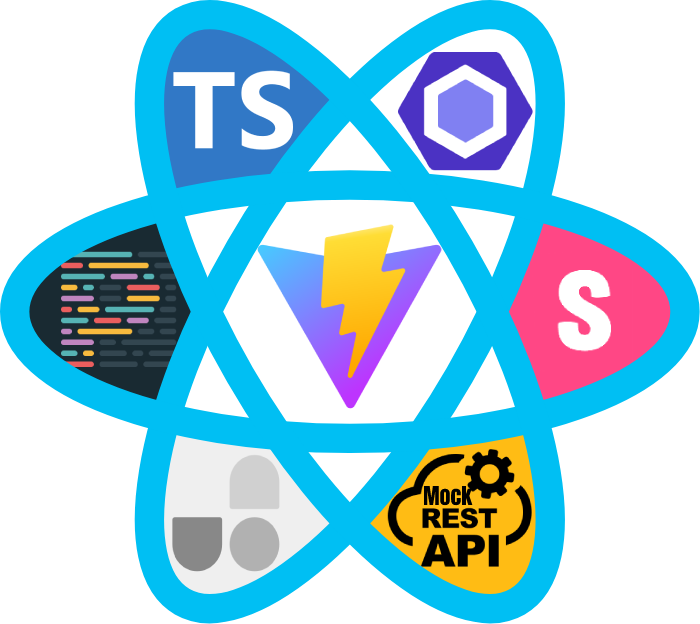

<p align="center">
   
</p>

# ⚡️ Viact

<p>Viact is a starter template for React TypeScript that uses Vitejs, which supports RTL for specific styles, proxy fetching API (to fix CORS errors) and a simple mock REST API server. <br />Additionally, Is set up VScode, Storybook, ErrorBoundary, UnoCss (atomic CSS engine), Eslint, Prettier, and more.</p>

# Synopsis & Motivation

<p>It's an opinionated setup for modern web applications (a GitHub template). This is a set of essential (and minimal) libraries, components, and utilities that developers typically require when developing React applications.</p>
<p>Almost all projects need to have a router, a UI framework, error handling, base file/folder structure, a builder, some developer tools (eslint, prettier, postcss, etc), and many more. As a starter kit, we tried to include the best options available in the above fields.</p>

# Features

<p>Viact is a minimalist starter template, it includes:</p>

- ⚡️ [Vite](https://vitejs.dev/) - Next Generation Frontend Tooling
- ⚛️ [React 18](https://reactjs.org/) - A JavaScript library for building user interfaces
- 🏄 [React Router DOM](https://reactrouter.com/)
- 💎 [TypeScript (of course)](https://www.typescriptlang.org/)
- 🎨 [UnoCSS](https://github.com/antfu/unocss) - the instant on-demand atomic CSS engine
- ✅ Safety - Https is enabled by default in development `https://localhost:3000/`
- 🔨 [EsLint](https://eslint.org/) - Pluggable JavaScript linter
- 🌀 [Prettier](https://prettier.io) - Opinionated Code Formatter
- 📭 [PostCss](https://postcss.org/) - Supports RTL for specific styles & autoprefixer (add vendor prefixes)
- ☄️ [Conventional Commit](https://commitlint.js.org/#/)
- 🎯 Absolute import by using `~/...`
- ⚙️ Proxying API Requests in Development
- 🔥 The easiest way to mock REST APIs! Based on (json-server)[https://github.com/typicode/json-server]
- 📕 [Storybook](https://storybook.js.org/)
- 🗃️ Minify images (image compressor) Automatically (in production)
- 🖌️ Support Sass/Scss/Less 

# Prerequisites
-  📦 [Node.js >=16](https://nodejs.org/)
-  📦 [Yarn >=1](https://yarnpkg.com/)
# Getting Started

### GitHub Template

[Create a repo from this template on GitHub.](https://github.com/MR-Mostafa/Viact/generate)

### Clone to local

<p>If you would prefer to do it manually, use the following:</p>

```bash
git clone https://github.com/MR-Mostafa/Viact.git
cd Viact
```

<p>After that, follow these steps to clean the git history and install the dependencies:</p>

```bash
yarn install         # Install all dependencies
yarn run reset       # Reset and clean all files you don't need, and clean git history
```

# Folder Structure

<p>Simple folder structures, no configuration needed, just the files you need:</p>

```
Viact
├── .storybook          # Storybook configuration
├── .vite-cache         # Vite cache (for faster builds)
├── .vscode             # VSCode configuration
├── mock                # Full fake REST API server (Create a mock API server with `json-server`)
├── node_modules        # Node modules
├── postcss             # Postcss RTLCSS Plugin
└── src                 # Your source code that will be compiled to dist folder
|    ├── api
|    ├── assets
|    |    ├── fonts
|    |    ├── images
|    |    └── styles
|    |        ├── utils                # Utility styles
|    |        ├── styles.rtl.scss      # Global rtl styles
|    |        └── styles.scss          # Global styles
|    ├── components
|    ├── constants
|    ├── containers
|    ├── env
|    ├── pages
|    ├── sections
|    ├── store
|    ├── types
|    ├── utils
|    ├── App.tsx
|    ├── main.tsx
|    └── Routes.tsx
├── .gitignore
├── index.html
├── package.json
├── README.md
├── vite.config.js
...
```

# Available Scripts
<p>In this project, you can run the following scripts:</p>

| Script                   | Description                                                                    |
| ------------------------ | ------------------------------------------------------------------------------ |
| yarn run dev             | Runs the app in the development mode. (With HTTPS)                             |
| yarn run dev:http        | Runs the app in the development mode. (**Without** HTTPS)                      |
| yarn run build           | Builds the app for production to the `dist` folder.                            |
| yarn run preview         | Builds the app for production to the `dist` folder, and run locally server.    |
| yarn run analyze         | Builds the app for production to the `dist` folder, and active analyze mode.   |
| yarn run reset           | Reset and clean all files you don't need, and clean git history.               |
| yarn run mock:server     | Run the server for the fake rest API.                                          |
| yarn run storybook       | Run the documentation for the UI.                                              |
| yarn run build-storybook | Builds the documentation for the UI.                                           |

# UnoCSS
Plese see this link for more information about UnoCSS:<br />
- [Unocss](https://github.com/unocss/unocss)
- [Let’s Define Exactly What Atomic CSS is](https://css-tricks.com/lets-define-exactly-atomic-css/)
- [Atomic CSS](https://acss.io/)
- [Reimagine Atomic CSS](https://antfu.me/posts/reimagine-atomic-css)
### The default CSS Preset (Atomic CSS Class)
As you might know, Tailwind and Windi CSS transform specific class names in the HTML file (or in the JSX or TSX file) to specific property styles as you need them(on-demand). <br />
A number of rules have been defined for the use of commonly used styles, Which is defined in the following file:

```
./acss.ts
```

- Support all utilities styles
- Support css Pseudo Classes/Elements
- Support group selectors, like .navbar a {...}
- Support CSS variables

### Rules:
- In classNames, spaces cannot be used (because a new class has already been defined). <br />Therefore, the underscore(_) sign should be used instead of a space. We will now replace the underscore(_) sign with a space.
- **For Group Selectors:**
	- Group Selectors must start with @
	- All selectors must end with dollar sign ($)
	- The classname can only contain one dollar sign ($)<br />
	**example:**
	```
        space between
              👆
      @.wrapper_p$fs[16px] => .wrapper p{font-size: 16px;}
      👇         👇
      👇    end group selectors
      👇
     start group selectors
	```

#### example
You can use utility classes in your components and stylesheets as usua.

| ACSS ClassName     | Corresponding CSS                                       |
| ------------------ | --------------------------------------------------------- |
| pt-[10]		      | padding-top: 1.5rem; **The default unit is the rem**      |
| py-[1.5rem]		   | padding-top: 1.5rem; <br /> padding-bottom: 1.5rem;       |
| bd-[1px_solid_#F5F5F5] | border: 1px solid #F5F5F5; |
| bdt-[1px_solid_#F5F5F5]  | border-top: 1px solid #F5F5F5;  |
| br-[10px] |  border-radius: 10px; |
| bgc-[#fff] | background-color: #fff; |
| w-[100vw] | width: 100vw; |
| fs-[1.2em] | font-size: 1.2em |
| text-[center] | text-align: center |
| px-[1rem] | padding-left: 1rem; <br /> padding-right: 1rem; |
| @.navbar_a$fs-[1.4rem] **Group Selectors** | .navbar a { font-size: 1.4rem; } |
| @.github:hover_svg$fill-[#fff] | .github:hover svg { fill: #fff !important; } |
| hover:bg[red] **Pseudo Classes** | elem:hover{background: red;} |
| after:cnt[text] **Pseudo Elements** | elem::after{content: "text"} |
| root:[--primary:#0d6efd] **Global CSS variables** | :root {--primary: #0d6efd;} |
| elem:[--primary:#0d6efd] **Local CSS variables** | elem {--primary: #0d6efd;} |

# Set Proxy (If you need)
For Set Proxy, please see and edit the `proxy` field in file `.vite.config.js`

# Fake REST API (If you need)
To create mock REST APIs, see the `mock` folder. <br />
We use `json-server` to create mock REST APIs. Plese see the following link for more information:<br />
[json-server](https://github.com/typicode/json-server)
# Checklist

Be sure to follow the checklist when updating your information using this template

- [ ] Change the title in `index.html`
- [ ] Change the favicon in `./src/assets/images`
- [ ] Change the `name, description, author, keywords, homepage, repository and bugs` field in `package.json`

And, enjoy :)
